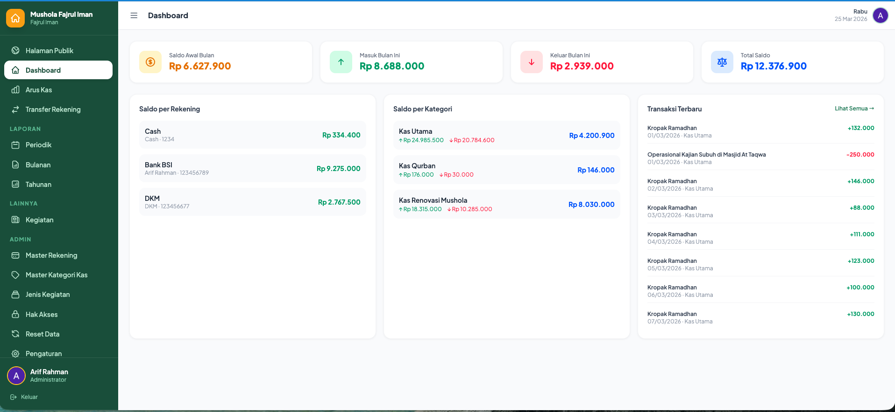

# 🕌 Keuangan Mushola — Sistem Pencatatan Keuangan Digital

Aplikasi pencatatan keuangan berbasis **Laravel 11 + Livewire Volt** untuk masjid/mushola.

---

## 📋 Fitur Utama

- ✅ **Login Google OAuth** — tidak perlu password manual
- ✅ **Beranda** — counter masuk, keluar, sisa saldo bulan ini, per rekening & kategori
- ✅ **Arus Kas** — CRUD transaksi masuk/keluar dengan filter & pagination
- ✅ **Pindah Rekening** — transfer antar rekening tanpa mempengaruhi saldo kategori
- ✅ **Laporan Periodik** — filter tanggal bebas, export PDF + Excel
- ✅ **Laporan Bulanan** — pilih bulan/tahun, ringkasan + detail per kategori
- ✅ **Laporan Tahunan** — rekap 12 bulan + per kategori
- ✅ **Cetak PDF** — laporan profesional dengan detail per kategori
- ✅ **Export Excel** — semua data bisa diunduh
- ✅ **Kegiatan** — jadwal pengajian, dakwah, dengan foto & artikel
- ✅ **Hak Akses** — admin, bendahara, editor, viewer
- ✅ **Mobile Friendly** — sidebar responsive, layout adaptif

## 📷 Screenshot

Screenshots telah ditambahkan di folder `docs/`:

1. `0_halaman_login.png`
2. `1_halaman_public.png`
3. `2_halaman_dashboard.png`
4. `3_halaman_aruskas.png`
5. `4_halaman_transfer.png`
6. `5_halaman_lap_periodik.png`
7. `6_halaman_lap_bulanan.png`
8. `7_halaman_lap_tahunan.png`
9. `8_halaman_kegiatan.png`
10. `9_halaman_master_rekening.png`
11. `10_halaman_master_kategori_kas.png`
12. `11_halaman_jenis_kegiatan.png`
13. `12_halaman_hak_akses.png`
14. `13_halaman_reset_data.png`
15. `14_halaman_pengaturan.png`

Preview contoh (dashboard):



---

## 🗂️ Struktur Database

### Tabel `rekening`
| Field | Tipe |
|-------|------|
| id | bigint PK |
| nama_rek | varchar |
| atas_nama | varchar |
| no_rek | varchar |
| created_at, updated_at | timestamp |

**Data awal otomatis:**
- Cash / Cash / 1234
- Bank BSI / Arif Rahman / 123456789
- DKM / DKM / 123456677

### Tabel `kategori`
| Field | Tipe |
|-------|------|
| id | bigint PK |
| nama | varchar |
| saldo_awal | decimal(15,2) |
| masuk | decimal(15,2) |
| keluar | decimal(15,2) |
| saldo_akhir | decimal(15,2) |
| created_at, updated_at | timestamp |

**Data awal otomatis:**
- Kas Utama (saldo 0)
- Kas Qurban (saldo 0)
- Kas Renovasi Mushola (saldo 0)

### Tabel `keuangan`
| Field | Tipe |
|-------|------|
| id | bigint PK |
| masuk | decimal(15,2) |
| keluar | decimal(15,2) |
| keterangan | text |
| id_rekening | FK → rekening |
| id_kategori | FK → kategori |
| created_by | FK → users |
| tanggal | date |
| created_at, updated_at | timestamp |

### Tabel `transfer_rekening`
| Field | Tipe |
|-------|------|
| id | bigint PK |
| dari_rekening | FK → rekening |
| ke_rekening | FK → rekening |
| id_kategori | FK → kategori |
| jumlah | decimal(15,2) |
| keterangan | text |
| tanggal | date |
| created_by | FK → users |

### Tabel `kegiatan`
| Field | Tipe |
|-------|------|
| id | bigint PK |
| judul | varchar |
| jenis | enum(pengajian,dakwah,lainnya) |
| konten | text |
| foto | varchar (path) |
| tanggal_kegiatan | datetime |
| lokasi | varchar |
| created_by | FK → users |

---

## 🚀 Cara Instalasi

### 1. Clone & Install Dependencies

```bash
git clone <repo-url> mushola-keuangan
cd mushola-keuangan

composer install
npm install
```

### 2. Konfigurasi Environment

```bash
cp .env.example .env
php artisan key:generate
```

Edit `.env`:
```env
APP_NAME="Keuangan Mushola"
APP_URL=http://localhost:8000

DB_CONNECTION=mysql
DB_HOST=127.0.0.1
DB_PORT=3306
DB_DATABASE=mushola_keuangan
DB_USERNAME=root
DB_PASSWORD=your_password

GOOGLE_CLIENT_ID=your_google_client_id
GOOGLE_CLIENT_SECRET=your_google_client_secret
GOOGLE_REDIRECT_URI=http://localhost:8000/auth/google/callback
```

### 3. Setup Google OAuth

1. Buka [Google Cloud Console](https://console.cloud.google.com/)
2. Buat project baru
3. Pergi ke **APIs & Services → Credentials**
4. Buat **OAuth 2.0 Client ID** (Web Application)
5. Tambahkan Authorized Redirect URI: `http://yourdomain.com/auth/google/callback`
6. Salin **Client ID** dan **Client Secret** ke `.env`

### 4. Migrasi & Seed Database

```bash
mysql -u root -p -e "CREATE DATABASE mushola_keuangan CHARACTER SET utf8mb4 COLLATE utf8mb4_unicode_ci;"

php artisan migrate --seed
```

### 5. Storage Link

```bash
php artisan storage:link
```

### 6. Jalankan Aplikasi

```bash
php artisan serve
# atau untuk production
php artisan optimize
```

---

## 👑 Setup Admin Pertama

Untuk membuat admin pertama, cukup lakukan ini:

1. Atur `ADMIN_SECRET` di file `.env` (misalnya `ADMIN_SECRET=DKM@FajrulIman2026`).
2. Login pertama kali menggunakan Google.
3. Setelah login, halaman akan meminta `Password Install` (`admin_secret`). Masukkan yang sama dengan nilai di `.env`.

Jika benar, akun Anda otomatis mendapatkan role **admin**.

Setelah menjadi admin, Anda bisa mengatur hak akses pengguna lain melalui halaman **Hak Akses** di aplikasi.

---

## 🔐 Sistem Hak Akses

| Peran | Lihat | Input/Edit/Hapus | Atur User |
|-------|-------|-----------------|-----------|
| **Admin** | ✅ | ✅ | ✅ |
| **Bendahara** | ✅ | ✅ | ❌ |
| **Editor** | ✅ | ✅ (kegiatan, jenis kegiatan) | ❌ |
| **Viewer** | ✅ | ❌ | ❌ |

---

## 📄 Laporan & Export

### Laporan Periodik
- Filter dari-sampai tanggal bebas
- Menampilkan saldo awal (dari sebelum tanggal mulai), masuk, keluar, saldo akhir
- Per kategori dan per rekening
- Export PDF & Excel

### Laporan Bulanan
- Pilih bulan & tahun
- Ringkasan + detail transaksi per kategori
- Export PDF & Excel

### Laporan Tahunan
- Rekap 12 bulan dalam satu tahun
- Per kategori
- Export PDF & Excel

---

## 🔧 Konfigurasi config/services.php

Pastikan ada konfigurasi Google di `config/services.php`:

```php
'google' => [
    'client_id'     => env('GOOGLE_CLIENT_ID'),
    'client_secret' => env('GOOGLE_CLIENT_SECRET'),
    'redirect'      => env('GOOGLE_REDIRECT_URI'),
],
```

---

## 📦 Package yang Digunakan

| Package | Fungsi |
|---------|--------|
| `livewire/livewire` | Reactive UI components |
| `livewire/volt` | Single-file Livewire components |
| `laravel/socialite` | Google OAuth |
| `maatwebsite/excel` | Export Excel |
| `barryvdh/laravel-dompdf` | Generate PDF |

---

## 🗂️ Struktur File Penting

```
app/
  Http/Controllers/
    GoogleAuthController.php   ← Handle Google login
    ExportController.php       ← Excel & PDF export
  Models/
    User.php, Keuangan.php, Kategori.php
    Rekening.php, TransferRekening.php
    Kegiatan.php, Role.php

database/
  migrations/                  ← Semua migrasi tabel
  seeders/DatabaseSeeder.php   ← Data awal rekening & kategori

resources/views/
  auth/login.blade.php         ← Halaman login Google
  layouts/app.blade.php        ← Layout utama + sidebar
  livewire/
    home.blade.php             ← Beranda (Volt)
    arus-kas/index.blade.php   ← Arus Kas (Volt)
    laporan/
      periodik.blade.php       ← Laporan Periodik (Volt)
      bulanan.blade.php        ← Laporan Bulanan (Volt)
      tahunan.blade.php        ← Laporan Tahunan (Volt)
    kegiatan/index.blade.php   ← Kegiatan (Volt)
    profile.blade.php          ← Profil (Volt)
    hak-akses.blade.php        ← Hak Akses (Volt)
  laporan/pdf.blade.php        ← Template PDF

routes/web.php                 ← Semua route
```

---

## 💡 Tips Penggunaan

1. **Pindah Rekening**: Gunakan tombol "Transfer" di halaman Arus Kas untuk mencatat perpindahan dana antar rekening tanpa mempengaruhi saldo kategori.

2. **Saldo Kategori**: Saldo setiap kategori dihitung otomatis dari semua transaksi yang masuk/keluar di kategori tersebut.

3. **Laporan Periodik vs Bulanan**: 
   - Periodik: tanggal bebas, cocok untuk laporan khusus
   - Bulanan: pilih bulan/tahun, sudah otomatis menghitung saldo awal dari bulan sebelumnya

4. **Hak Akses**: Admin bisa mengatur siapa yang bisa input/edit transaksi. Viewer hanya bisa melihat laporan.

---

*Dibuat dengan ❤️ untuk kemajuan pengelolaan keuangan mushola Indonesia*
